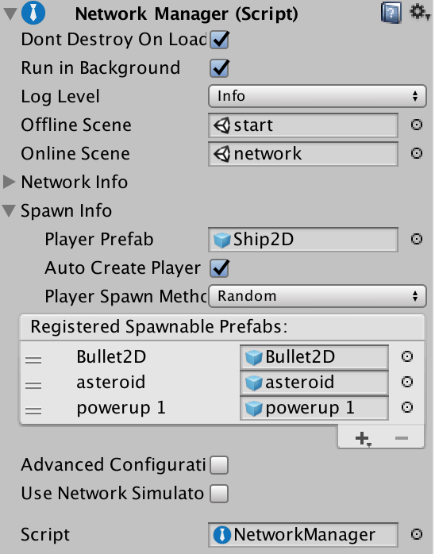

# Spawning GameObjects

In Mirror, you usually “spawn” (that is, create) new GameObjects with `Instantiate`. However, in the multiplayer High Level API, the word “spawn” means something more specific. In the server-authoritative model of the HLAPI, to “spawn” a GameObject on the server means that the GameObject is created on clients connected to the server, and is managed by the spawning system.

Once the GameObject is spawned using this system, state updates are sent to clients whenever the GameObject changes on the server. When Mirror destroys the GameObject on the server, it also destroys it on the clients. The server manages spawned GameObjects alongside all other networked GameObjects, so that if another client joins the game later, the server can spawn the GameObjects on that client. These spawned GameObjects have a unique network instance ID called “netId” that is the same on the server and clients for each GameObject. The unique network instance ID is used to route messages set across the network to GameObjects, and to identify GameObjects.

When the server spawns a GameObject with a Network Identity component, the GameObject spawned on the client has the same “state”. This means it is identical to the GameObject on the server; it has the same Transform, movement state, and (if NetworkTransform and SyncVars are used) synchronized variables. Therefore, client GameObjects are always up-to-date when Mirror creates them. This avoids issues such as GameObjects spawning at the wrong initial location, then reappearing at their correct position when a state update arrives.

The Network Manager before trying to register it with the Network Manager.

To register a Prefab with the Network Manager in the Editor, select the Network Manager GameObject, and in the Inspector, navigate to the Network Manager component. Click the triangle next to Spawn Info to open the settings, then under Registered Spawnable Prefabs, click the plus (+) button. Drag and drop Prefabs into the empty field to assign them to the list.



## Spawning Without Network Manager

For more advanced users, you may find that you want to register Prefabs and spawn GameObjects without using the NetworkManager component.

To spawn GameObjects without using the Network Manager, you can handle the Prefab registration yourself via script. Use the ClientScene.RegisterPrefab method to register Prefabs to the Network Manager.

### Example: MyNetworkManager

```
using UnityEngine;
using Mirror;

public class MyNetworkManager : MonoBehaviour 
{
    public GameObject treePrefab;
    NetworkClient myClient;

    // Create a client and connect to the server port
    public void ClientConnect() {
        ClientScene.RegisterPrefab(treePrefab);
        myClient = new NetworkClient();
        myClient.RegisterHandler(MsgType.Connect, OnClientConnect);
        myClient.Connect("127.0.0.1", 4444);
    }

    void OnClientConnect(NetworkMessage msg) {
        Debug.Log("Connected to server: " + msg.conn);
    }
}
```

In this example, you create an empty GameObject to act as the Network Manager, then create and attach the `MyNetworkManager` script (above) to that GameObject. Create a Prefab that has a Network Identity component attached to it, and drag that onto the treePrefab slot on the MyNetworkManager component in the Inspector. This ensures that when the server spawns the tree GameObject, it also creates the same kind of GameObject on the clients.

Registering Prefabs ensures that the Asset, so that there is no stalling or loading time for creating the Asset.

However, for the script to work, you also need to add code for the server. Add this to the MyNetworkManager script:

```
public void ServerListen()
{
    NetworkServer.RegisterHandler(MsgType.Connect, OnServerConnect);
    NetworkServer.RegisterHandler(MsgType.Ready, OnClientReady);

    if (NetworkServer.Listen(4444))
        Debug.Log("Server started listening on port 4444");
}

// When client is ready spawn a few trees
void OnClientReady(NetworkMessage msg)
{
    Debug.Log("Client is ready to start: " + msg.conn);
    NetworkServer.SetClientReady(msg.conn);
    SpawnTrees();
}

void SpawnTrees()
{
    int x = 0;
    for (int i = 0; i < 5; ++i)
    {
        var treeGo = Instantiate(treePrefab, new Vector3(x++, 0, 0), Quaternion.identity);
        NetworkServer.Spawn(treeGo);
    }
}

void OnServerConnect(NetworkMessage msg)
{
    Debug.Log("New client connected: " + msg.conn);
}
```

The server does not need to register anything, as it knows what GameObject is being spawned (and the asset ID is sent in the spawn message). The client needs to be able to look up the GameObject, so it must be registered on the client.

When writing your own network manager, it’s important to make the client ready to receive state updates before calling the spawn command on the server, otherwise they won’t be sent. If you’re using Mirror’s built-in Network Manager component, this happens automatically.

For more advanced uses, such as object pools or dynamically created Assets, you can use the ClientScene.RegisterSpawnHandler method, which allows callback functions to be registered for client-side spawning. See documentation on Custom Spawn Functions for an example of this.

If the GameObject has a network state like synchronized variables, then that state is synchronized with the spawn message. In the following example, this script is attached to the tree Prefab:

```
using UnityEngine;
using Mirror;

class Tree : NetworkBehaviour
{
    [SyncVar]
    public int numLeaves;

    public override void OnStartClient()
    {
        Debug.Log("Tree spawned with leaf count " + numLeaves);
    }
}
```

With this script attached, you can change the `numLeaves` variable and modify the `SpawnTrees` function to see it accurately reflected on the client:

```
void SpawnTrees()
{
    int x = 0;
    for (int i = 0; i < 5; ++i)
    {
        gameObject treeGo = Instantiate(treePrefab, new Vector3(x++, 0, 0), Quaternion.identity);
        Tree tree = treeGo.GetComponent<Tree>();
        tree.numLeaves = Random.Range(10,200);
        Debug.Log("Spawning leaf with leaf count " + tree.numLeaves);
        NetworkServer.Spawn(treeGo);
    }
}
```

Attach the `Tree` script to the `treePrefab` script created earlier to see this in action.

### Constraints

-   A NetworkIdentity must be on the root GameObject of a spawnable Prefab. Without this, the Network Manager can’t register the Prefab.
-   NetworkBehaviour scripts must be on the same GameObject as the NetworkIdentity, not on child GameObjects

## GameObject Creation Flow

The actual flow of internal operations that takes place for spawning GameObjects is:

-   Prefab with Network Identity component is registered as spawnable.
-   GameObject is instantiated from the Prefab on the server.
-   Game code sets initial values on the instance (note that 3D physics forces applied here do not take effect immediately).
-   `NetworkServer.Spawn` is called with the instance.
-   The state of the SyncVars on the instance on the server are collected by calling `OnSerialize` on [Network Behaviour] components.
-   A network message of type `MsgType.ObjectSpawn` is sent to connected clients that includes the SyncVar data.
-   `OnStartServer` is called on the instance on the server, and `isServer` is set to `true`
-   Clients receive the `ObjectSpawn` message and create a new instance from the registered Prefab.
-   The SyncVar data is applied to the new instance on the client by calling OnDeserialize on Network Behaviour components.
-   `OnStartClient` is called on the instance on each client, and `isClient` is set to `true`
-   As gameplay progresses, changes to SyncVar values are automatically synchronized to clients. This continues until game ends.
-   `NetworkServer.Destroy` is called on the instance on the server.
-   A network message of type `MsgType.ObjectDestroy` is sent to clients.
-   `OnNetworkDestroy` is called on the instance on clients, then the instance is destroyed.

### Player GameObjects

Player GameObjects in the HLAPI work slightly differently to non-player GameObjects. The flow for spawning player GameObjects with the Network Manager is:

-   Prefab with `NetworkIdentity` is registered as the `PlayerPrefab`
-   Client connects to the server
-   Client calls `AddPlayer`, network message of type `MsgType.AddPlayer` is sent to the server
-   Server receives message and calls `NetworkManager.OnServerAddPlayer`
-   GameObject is instantiated from the PlayerPrefab on the server
-   `NetworkManager.AddPlayerForConnection` is called with the new player instance on the server
-   The player instance is spawned - you do not have to call `NetworkServer.Spawn` for the player instance. The spawn message is sent to all clients like on a normal spawn.
-   A network message of type `MsgType.Owner` is sent to the client that added the player (only that client!)
-   The original client receives the network message
-   `OnStartLocalPlayer` is called on the player instance on the original client, and `isLocalPlayer` is set to true

Note that `OnStartLocalPlayer` is called after `OnStartClient`, because it only happens when the ownership message arrives from the server after the player GameObject is spawned, so `isLocalPlayer` is not set in `OnStartClient`.

Because `OnStartLocalPlayer` is only called for the client’s local player GameObject, it is a good place to perform initialization that should only be done for the local player. This could include enabling input processing, and enabling camera tracking for the player GameObject.

## Spawning GameObjects with Client Authority

To spawn GameObjects and assign authority of those GameObjects to a particular client, use NetworkServer.SpawnWithClientAuthority, which takes as an argument the `NetworkConnection` of the client that is to be made the authority.

For these GameObjects, the property `hasAuthority` is true on the client with authority, and `OnStartAuthority` is called on the client with authority. That client can issue commands for that GameObject. On other clients (and on the host), `hasAuthority` is false.

Objects spawned with client authority must have `LocalPlayerAuthority` set in their `NetworkIdentity`.

For example, the tree spawn example above can be modified to allow the tree to have client authority like this (note that we now need to pass in a NetworkConnection GameObject for the owning client’s connection):

```
void SpawnTrees(NetworkConnection conn)
{
    int x = 0;
    for (int i = 0; i < 5; ++i)
    {
        var treeGo = Instantiate(treePrefab, new Vector3(x++, 0, 0), Quaternion.identity);
        var tree = treeGo.GetComponent<Tree>();
        tree.numLeaves = Random.Range(10,200);
        Debug.Log("Spawning leaf with leaf count " + tree.numLeaves);
        NetworkServer.SpawnWithClientAuthority(treeGo, conn);
    }
}
```

The Tree script can now be modified to send a command to the server:

```
public override void OnStartAuthority()
{
    CmdMessageFromTree("Tree with " + numLeaves + " reporting in");
}

[Command]
void CmdMessageFromTree(string msg)
{
    Debug.Log("Client sent a tree message: " + msg);
}
```

Note that you can’t just add the `CmdMessageFromTree` call into `OnStartClient`, because at that point the authority has not been set yet, so the call would fail.
