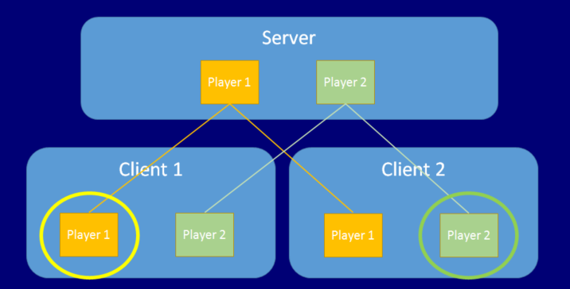

# Player GameObjects

Mirror’s multiplayer HLAPI system handles player GameObjects differently to non-player GameObjects. When a new player joins the game (when a new client connects to the server), that player’s GameObject becomes a “local player” GameObject on the client of that player, and Unity associates the player’s connection with the player’s GameObject. Unity associates one player GameObject for each person playing the game, and routes networking commands to that individual GameObject. A player cannot invoke a command on another player’s GameObject, only their own.

The NetworkBehaviour class (which you derive from to create your network scripts) has a property called isLocalPlayer. On each client’s player GameObject, Mirror sets that property to true on the NetworkBehaviour script, and invokes the OnStartLocalPlayer() callback. This means each client has a different GameObject set up like this, because on each client a different GameObject is the one that represents the local player. The diagram below shows two clients and their local players.

Only the player GameObject that is “yours” (from your point of view as the player) has the `isLocalPlayer` flag set. Usually you should set this flag in script to determine whether to process input, whether to make the camera track the GameObject, or do any other client-side things that should only occur for the player belonging to that client.

Player GameObjects represent the player (that is, the person playing the game) on the server, and have the ability to run commands from the player’s client. These commands are secure client-to-server remote procedure calls. In this server-authoritative system, other non-player server-side GameObjects cannot receive commands directly from client-side GameObjects. This is both for security, and to reduce the complexity of building your game. By routing all incoming commands from users through the player GameObject, you can ensure that these messages come from the right place, the right client, and can be handled in a central location.

The Network Manager adds a player every time a client connects to the server. In some situations though, you might want it not to add players until an input event happens - such as a user pressing a “start” button on the controller. To disable automatic player creation, navigate to the Network Manager component’s Inspector and untick the Auto Create Player checkbox.
