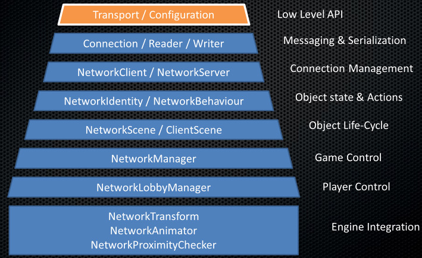

# The Multiplayer High Level API

Mirror’s multiplayer High Level API (HLAPI) is a system for building multiplayer capabilities for Unity games. It is built on top of the lower level transport real-time communication layer, and handles many of the common tasks that are required for multiplayer games. While the transport layer supports any kind of network topology, the HLAPI is a server authoritative system; although it allows one of the participants to be a client and the server at the same time, so no dedicated server process is required. Working in conjunction with the internet services, this allows multiplayer games to be played over the internet with little work from developers.

The HLAPI is focused on ease of use and iterative development and provides useful functionality for multiplayer games, such as:

-   Message handlers
-   General purpose high performance serialization
-   Distributed object management
-   State synchronization
-   Network classes: Server, Client, Connection, etc

The HLAPI is built from a series of layers that add functionality:

## Server and Host

In Mirror’s High Level API (HLAPI) system, multiplayer games include:

-   **Server**  
    A server is an instance of the game which all other players connect to when they want to play together. A server often manages various aspects of the game, such as keeping score, and transmit that data back to the client.

-   **Clients**  
    Clients are instances of the game that usually connect from different computers to the server. Clients can connect over a local network, or online.

A client is an instance of the game that connects to the server, so that the person playing it can play the game with other people, who connect on their own clients.

The server might be either a “dedicated server”, or a “host server”.

-   **Dedicated server**  
    This is an instance of the game that only runs to act as a server.

-   **Host server**  
    When there is no dedicated server, one of the clients also plays the role of the server. This client is the “host server”. The host server creates a single instance of the game (called the host), which acts as both server and client.

The diagram below represents three players in a multiplayer game. In this game, one client is also acting as host, which means the client itself is the “local client”. The local client connects to the host server, and both run on the same computer. The other two players are remote clients - that is, they are on different computers, connected to the host server.

The host is a single instance of your game, acting as both server and client at the same time. The host uses a special kind of internal client for local client communication, while other clients are remote clients. The local client communicates with the server through direct function calls and message queues, because it is in the same process. It actually shares the Scene with the server. Remote clients communicate with the server over a regular network connection. When you use Mirror’s HLAPI, this is all handled automatically for you.

One of the aims of the multiplayer system is for the code for local clients and remote clients to be the same, so that you only have to think about one type of client most of the time when developing your game. In most cases, Mirror handles this difference automatically, so you should rarely need to think about the difference between your code running on a local client or a remote client.

## Instantiate and Spawn

When you make a single player game In Mirror, you usually use the `GameObject.Instantiate` method to create new GameObjects at runtime. However, with a multiplayer system, the server itself must “spawn” GameObjects in order for them to be active within the networked game. When the server spawns GameObjects, it triggers the creation of GameObjects on connected clients. The spawning system manages the lifecycle of the GameObject, and synchronizes the state of the GameObject based on how you set the GameObject up.

For more details about networked instantiating and spawning, see documentation on Spawning GameObjects.

## Players and Local Players

Mirror’s multiplayer HLAPI system handles player GameObjects differently to non-player GameObjects. When a new player joins the game (when a new client connects to the server), that player’s GameObject becomes a “local player” GameObject on the client of that player, and Mirror associates the player’s connection with the player’s GameObject. Mirror associates one player GameObject for each person playing the game, and routes networking commands to that individual GameObject. A player cannot invoke a command on another player’s GameObject, only their own.

For more details, see documentation on Player GameObjects.

## Authority

Servers and clients can both manage a GameObject’s behavior. The concept of “authority” refers to how and where a GameObject is managed. Mirror’s HLAPI is based around “server authority” as the default state, where the Server (the host) has authority over all GameObjects which do not represent players. Player GameObjects are a special case and treated as having “local authority”. You may want to build your game using a different system of authority - for more details, see Network Authority.
