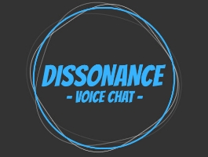

# Integrations

Here we will maintain a list of assets known to be compatible with Mirror.  If you know of others, please have the publisher contact us directly in our [Discord](https://discord.gg/2BvnM4R).

## [Network Sync Transform](https://github.com/emotitron/NetworkSyncTransform)

## [SmoothSync](https://assetstore.unity.com/packages/tools/network/smooth-sync-96925)

## [Weather Maker](https://assetstore.unity.com/packages/tools/particles-effects/weather-maker-unity-weather-system-sky-water-volumetric-clouds-a-60955)

## [Noble Connect Free](https://assetstore.unity.com/packages/tools/network/noble-connect-free-141599)

## [Dissonance Voice Chat](https://assetstore.unity.com/packages/tools/audio/dissonance-voice-chat-70078)

## [RTS Engine](https://assetstore.unity.com/packages/templates/packs/rts-engine-79732)

## [Rucksack](https://assetstore.unity.com/packages/templates/systems/rucksack-multiplayer-inventory-system-114921)

