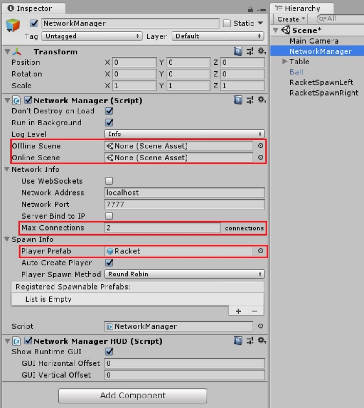
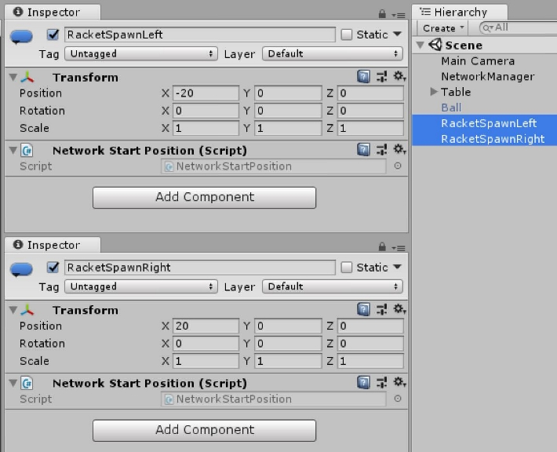
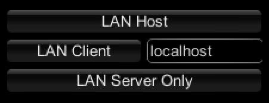

# Pong

A simple example for "How to built a multiplayer game with Mirror" is Pong,
which is included in the AssetStore package of Mirror. It illustrates the usage
of NetworkManager, NetworkManagerHUD, NetworkBehaviour, NetworkIdentity,
NetworkTransform, NetworkStartPosition and NetworkingAttributes.

## Setting the number of players

First of all, let's have a look at the NetworkManager object in the main scene.
When adding the NetworkManager component to a gameobject, a few default settings
are already set (**Don't destroy on Load**, **Run in Background**, ...) For
playing Pong the maximum number of players is 2, so the setting **Network
Info/Max connections** will also be 2. As there are no other scenes (lobby,
online or offline scene) in this sample the properties for **Offline Scene** and
**Online Scene** will stay empty.

## Creating the player

Furthermore every player needs a racket to play with. Each player who joins the
game will have his own controllable object, which represents him within the
game. This gameobject is called *PlayerObject*. For spawning the *PlayerObject*
a prefab has to be created, containing at least a NetworkIdentity component with
**Local Player Authority** checked. The **Local Player Authority** allows the
player to control and modify the gameobjects properties (e.g. for movement). The
NetworkManager needs a reference to this prefab, which is located in **Spawn
Info/Player Prefab**. To have the player movement synchronized over the network,
the player prefab also contains a NetworkTransform.

## Player start position

The main scene contains 2 gameobjects with only a NetworkStartPosition component
(gameobjects RacketSpawnLeft, RacketSpawnRight in the scene). These transforms
will be automatically registered by the NetworkManager as spawning positions.

## Setting up the network

A very convenient component for establish/testing connections is the
NetworkManagerHUD. It provides basic functionality for start a game as LAN
client, LAN server or host (LAN client and LAN server at the same time). It
requires the NetworkManager component.

## The ball of Pong

The ball is the main focus of Pong, as this is the object needed to score
points. Its NetworkIdentity component has neither **Server Only** nor **Local
Player Authority** checked, as it's moved by the server physics engine and can
be influenced by the players. As with the *PlayerObject* the position is
synchronized via NetworkTransform. When having multiple scenes, the ball can be
spawned by the NetworkManager, but to keep this sample simple, it's placed
directly within the main scene.
