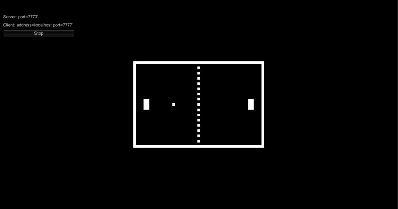

# Heading 1

## Heading 2

### Heading 3

#### Heading 4

##### Heading 5

Lorem ipsum dolor sit amet, consectetur *adipiscing elit, sed do eiusmod tempor* incididunt ut labore et dolore magna aliqua. Ut enim ad minim veniam, quis nostrud exercitation ullamco laboris nisi ut aliquip ex ea commodo consequat. **Duis aute irure** dolor in [^1] in voluptate velit esse cillum dolore eu fugiat nulla pariatur. Excepteur sint occaecat cupidatat non proident, sunt in culpa qui officia deserunt mollit anim id est laborum.

[^1]: reprehenderit: Footnote



-   Bullet
-   Bullet

1.  One
2.  Two
3.  Three

| Name  | Color  |
|-------|--------|
| Apple | Red    |
| Peach | Orange |

```cs
using System;
using UnityEngine;

namespace Mirror
{
    // sending messages on this connection causes the client's handler function to be invoked directly
    class ULocalConnectionToClient : NetworkConnection
    {
        LocalClient m_LocalClient;

        public LocalClient localClient { get {  return m_LocalClient; } }

        public ULocalConnectionToClient(LocalClient localClient)
        {
            address = "localClient";
            m_LocalClient = localClient;
        }

        protected override bool SendBytes(byte[] bytes, int channelId = Channels.DefaultReliable)
        {
            m_LocalClient.InvokeBytesOnClient(bytes);
            return true;
        }
    }
}
```
