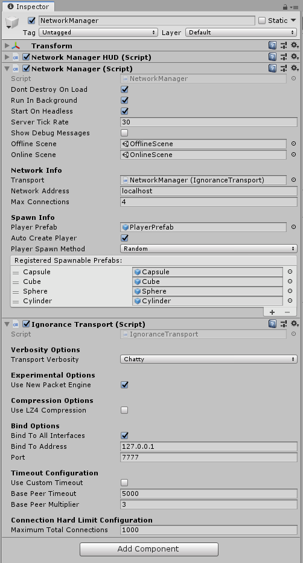

# Ignorance

## What is Ignorance?
Ignorance is a Transport layer developed by [Coburn](http://github.com/softwareguy) that integrates Mirror into the [ENET-C#](https://github.com/nxrighthere/ENet-CSharp) wrapper by nxrighthere. It was one of the first three transports to be integrated into Mirror. Ignorance implements a reliable and unreliable sequenced UDP transport for both 64bit desktop (Windows, Mac OS and Linux) and possibly mobile devices (Android, iOS) as well as channel support (first channel is reliable, second is unreliable).

ENET is a solid reliable UDP C++ network library that is mature and stable. There's a reason that the developer went with it.

Ignorance at the time of this article is at version 1.0.9.1 and fully supports Unity 2017.4 LTS. A version for Unity 2018 LTS with async support is planned and should arrive in 2019. *Ignorance was also designed to address that ugly TCP vs UDP war that many developers fought in.*



## Why would I want to use reliable UDP over TCP?
- if you have realtime communications that you need speed over reliability (VoIP...)
- if you need a data hose for your game (a first person shooter, racing game, etc)
- if you just want something that works (that's why you chose Mirror, right?)

## Why wouldn't I want to use reliable UDP over TCP?
- if you have **mission critical** things (as in, data **NEEDS** to go from A and B, no exceptions)
- if you need fully reliable network protocol
- if you're paranoid
- if you're making a Minecraft-like game and need to keep everyone in sync

## I want to know more about reliable UDP...
A little explaination is required. UDP is best described as a "shattershot" data transmission protocol, which means you just spray packets at a destination and hope for the best. The remote destination may or may not receive those packets, nor are they going to be in order. For example, if you have a packet stream that is:
```
1 2 3 4 5 6 7
```
...then it may end up like any of the following on the other end due to packets arriving out of order (note that a dot means packet loss in these examples:
```
7 6 1 3 2 4 5
7 6 . . 4 . 1
. . . . 1 2 3
1 2 3 5 4 6 7
```

Now, about sequencing and reliable mode. **Sequencing** basically tags packets so they know what number they are when being dispatched. So if you send packets `100, 101, 102` to the remote destination, the other end will reconstruct the packet in that order rather than in a different order (like `101, 100, 102`). If a packet is missing, it'll be skipped but the network library will take note that it's missing and compensate.

**Reliable** mode just tells ENET to send this while waiting for the remote to acknowledge packet reception, before claiming it was 'lost'. ENET will still classify said packets as lost if it doesn't hear back from the remote, but it will retransmit them to compensate for lossy connections or high latency situations. Reliable mode tries to emulate some of TCP's resending if not acknowledged in time, but as UDP does not have all the overhead TCP protocol has, it adds some packet overhead.

**Best of all, you DON'T NEED TO WORRY about all this! Ignorance in it's default state will use reliable UDP, which means the carrier pidegons will work overtime to get data from A to B correctly and in one piece.***

## Why Ignorance over the Unity LLAPI?
Unity's old LLAPI was horridly inefficient, and lots of testing has shown that you will get reduced performance using Unity LLAPI in your project. This is due to the design of the old networking code - Unity Tech made "by design" decisions and poor bug fixes that were seen to other developers as band-aids over a gaping wound. They did not care about performance or bug fixes.

Unity LLAPI was also closed source, meaning the Mirror developers could not take a knife to it and make it better. This is where the concept of Ignorance took shape.

## Who develops Ignorance?
[Coburn](http://github.com/softwareguy) is the lead developer of the transport. Oiran Studio actively uses this transport for networked game projects. It is currently also being utilized by some game projects, where you can find said developers on the Mirror Discord server.

## Does Ignorance support Websockets?
No, it does not. This is due to an issue with the fact that ENET is a C++ packet pumper and the ENET C# wrapper uses native C++ calls to talk to the network stack. Since it is not possible to convert a native ENET binary to WebGL, you will need to look elsewhere for Websockets support.

## Where can I get Ignorance?
[Grab the latest build from the releases page on the Ignorance repository](https://github.com/SoftwareGuy/Ignorance). Follow the instructions - it's simply a extra line or two of code plus dropping DLLs into your project.

## Where can I get support?
You can get support by opening a issue ticket on the [Ignorance repository issue tracker](https://github.com/SoftwareGuy/Ignorance/issues) or the #ignorance channel in the Mirror Discord server.

## I still don't understand what this transport is, my head is spinning, help!
Sorry, but this is probably not for you then. Come by the discord and we'll do our best to explain it in plain english.
