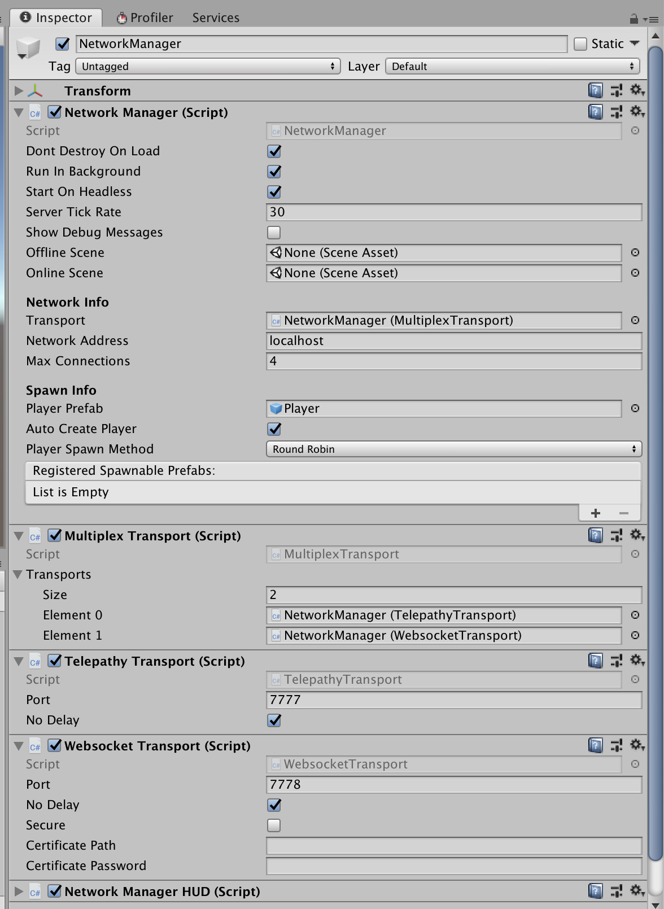

# MultiplexTransport

The MultiplexTransport is not a transport itself,  but it allows you to combine other transports so that your clients can connect to your servers via either one of them.

A common use case for the MultiplexTransport is a server listening to both websockets and TCP.  Your webgl clients can connect to the server using websockets and your mobile or desktop clients can connect to the same server via TCP.  In HLAPI,  you had to chose between websockets and UDP, but you cannot use both at the same time. You can configure any number of transports in the MultiplexTransport.

To use the MultiplexTransport follow these steps:

1. Add a gameobject with a NetworkManager to your scene if you have not done so
2. By default, Unity will add TelepathyTransport to your NetworkManager GameObject
3. Add a MultiplexTransport component to the gameobject
4. Assign the MultiplexTransport component in your NetworkManager's transport
5. Add a WebsocketTransport component to the gameobject
6. Add the TelepathyTransport component to the MultiplexTransport as the first transport
7. Add the WebsocketTransport component to the MultiplexTransport as the second transport

Please note that Telepathy and WebsocketTransport cannot listen to the same port.  By default Telepathy listens to 7777 and the websocket transport listens to 7778.

If you build your game as a webgl game,  the TelepathyTransport will be skipped and your client will use the websocket transport.   If you build your game as a mobile or desktop app,  it will choose TelepathyTransport. The server will happily accept connections from both.

Here is what the configuration should look like:

